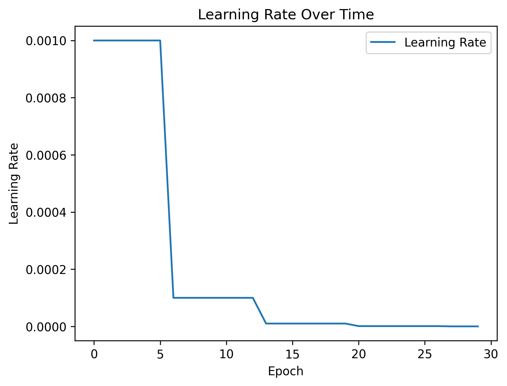
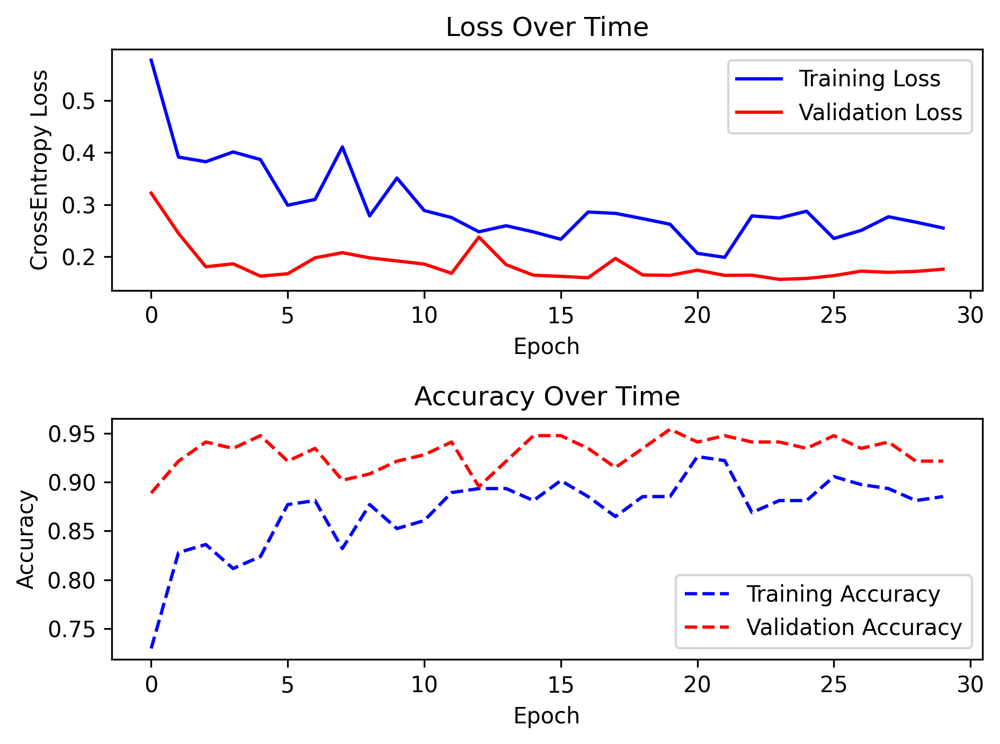

# Ant_Bee_Detection
**二分类问题：实现对蚂蚁和蜜蜂的识别**

20250329

***

## 一、项目介绍
这个项目的目标是使用 PyTorch 构建一个卷积神经网络（CNN），对蚂蚁和蜜蜂两种昆虫的图片进行分类。
数据集由包含这两种昆虫的图片组成，分为训练集和验证集。
通过训练过程，模型将学习如何区分这两种昆虫，并最终能够准确地对新图片进行分类。
### 项目结构
1. 数据准备
   - 数据集被划分为训练集和验证集。 
   - 使用了`torchvision.transforms`来定义数据预处理步骤，包括图像缩放、裁剪、归一化等。 
   - 使用`torch.utils.data.DataLoader`来加载数据集，方便批量处理。
2. 模型定义
   - 构建了一个简单的卷积神经网络，包含多个卷积层、池化层和全连接层。 
   - 最后一层使用全局平均池化层，以便处理不同大小的输入图像，并确保输出特征的尺寸一致。
3. 训练过程
   - 使用**交叉熵损失函数**作为目标函数。
   - 使用随机梯度下降（SGD）作为优化器，并设置了学习率衰减策略。
   - 在每个 epoch 结束时，根据验证集上的性能保存最佳模型。
4. 评估指标
   - 计算了每个 epoch 的损失和准确率。
   - 使用了进度条库 tqdm 来可视化训练进度。
5. 学习率曲线保存
   - 记录了每个 epoch 的学习率，并绘制了学习率曲线。
## 二、数据集介绍
### 数据集概况
- **来源** ：数据集来源于公开的数据源百度飞桨 -- 昆虫分类任务_数据集-飞桨AI Studio星河社区 (baidu.com) 。
- **类别** ：数据集中包含两类昆虫 —— 蚂蚁和蜜蜂。
- **图像数量** ：数据集通常会被细分为训练集、验证集和测试集。训练集用于训练模型；验证集用于调整超参数和防止过拟合；测试集则是在训练过程中未使用的数据，用于最终评估模型的泛化能力。

## GitHub相关操作
***
### Git 常用命令速查表
#### 1. 仓库操作
| 命令 | 说明 |
|------|------|
| `git init` | 初始化本地仓库 |
| `git clone <url>` | 克隆远程仓库 |
| `git remote -v` | 查看远程仓库地址 |
| `git remote add origin <url>` | 添加远程仓库 |

#### 2. 提交修改
| 命令 | 说明 |
|------|------|
| `git status` | 查看文件状态 |
| `git add <file>` | 添加文件到暂存区 |
| `git add .` | 添加所有修改 |
| `git commit -m "msg"` | 提交更改 |
| `git commit --amend` | 修改最后一次提交 |

#### 3. 分支管理
| 命令 | 说明 |
|------|------|
| `git branch` | 查看分支 |
| `git branch <name>` | 创建分支 |
| `git checkout <branch>` | 切换分支 |
| `git checkout -b <branch>` | 创建并切换分支 |
| `git merge <branch>` | 合并分支 |
| `git branch -d <branch>` | 删除分支 |

#### 4. 同步推送
| 命令 | 说明 |
|------|------|
| `git pull` | 拉取远程更新 |
| `git push` | 推送本地提交 |
| `git fetch` | 获取远程更新 |

#### 5. 撤销操作
| 命令 | 说明 |
|------|------|
| `git restore <file>` | 撤销工作区修改 |
| `git restore --staged <file>` | 取消暂存 |
| `git reset --hard HEAD^` | 回退到上一版本 |

#### 6. 查看信息
| 命令 | 说明 |
|------|------|
| `git log` | 查看提交历史 |
| `git log --oneline` | 简洁历史 |
| `git diff` | 查看差异 |

#### 7. 标签管理
| 命令 | 说明 |
|------|------|
| `git tag` | 查看标签 |
| `git tag v1.0` | 创建标签 |
| `git push --tags` | 推送标签 |

#### 8. 暂存修改
| 命令 | 说明 |
|------|------|
| `git stash` | 暂存当前修改 |
| `git stash pop` | 恢复暂存修改 |

#### 9. 配置信息
| 命令 | 说明 |
|------|------|
| `git config --global user.name "name"` | 设置用户名 |
| `git config --global user.email "email"` | 设置邮箱 |

#### 常用场景
- 首次提交
```bash
git init  
git add .  
git commit -m "Initial commit"  
git remote add origin <URL>  
git push -u origin main  
```
- 撤销最后一次提交
```bash
git reset --soft HEAD^  # 保留修改  
git reset --hard HEAD^  # 彻底丢弃  
```

### 通过本地操作让GitHub`同步删除已移除的文件`

1. 首先，在本地工作目录中确认该文件已经被物理删除或者不再需要保留。
2. 执行以下命令将其标记为被删除状态并提交更改到版本库。

```bash
git rm read_data.py.bak
```

此命令会从索引中移除指定文件，并准备在下次提交时反映这一变化。

3. 提交此次变更至本地存储库，附带描述信息以便后续追踪记录原因。

```Bash
git commit -m "Remove unused backup file read_data.py.bak"
```

上述命令将当前阶段的所有改动打包成一个新的提交对象存入历史日志里。

4. 将最新的修改推送到远端服务器上覆盖原有分支内容。

```Bash
git push origin main
```

这里假设默认主干名称为 `main`；如果项目采用的是其他命名约定，则需替换相应参数名。

***

### **如何将本地文件夹的更新同步到 GitHub**

为了将本地文件夹中的更改同步到 GitHub 存储库，可以按照以下方法操作：

#### 初始化 Git 仓库

如果尚未初始化本地项目的 Git 仓库，则需要运行以下命令来完成初始化：

```Bash
git init
```

此命令会在当前目录下创建一个新的 `.git` 文件夹，用于跟踪版本控制。

#### 添加远程存储库地址

假设已经有一个现有的 GitHub 项目，可以通过以下命令将其设置为远程存储库：

```Bash
git remote add origin https://github.com/<username>/<repository>.git
```

其中 `<username>` 是您的 GitHub 用户名，而 `<repository>` 是目标存储库名称。如果服务器能够连接到 GitHub，则可以直接执行上述命令；否则可能需要手动下载并上传必要的配置文件至服务器环境。

#### 跟踪变更与提交

当您对本地文件进行了修改之后（比如编辑 `README.md` 或新增了一个名为 `new.txt` 的文档），这些变化不会自动被推送到远端分支上。因此，必须先通过如下步骤处理它们:

- **查看状态**: 查看哪些文件发生了改变以及处于何种阶段。

  ```Bash
  git status
  ```

- **暂存更改**: 将所有已修改或者新建好的文件加入索引区域(即准备提交的状态卡)。

  ```Bash
  git add .
  ```

- **提交消息**: 提交所作的所有更动，并附带一条描述性的日志记录下来。

  ```Bash
  git commit -m "Add new changes including README update and additional file"
  ```

#### 推送数据至上游分支

最后一步就是把刚才所做的工作成果推送回云端上的主干线上去吧！如果是第一次推送的话，记得指定好对应的branch name哦～比如说master或者是main之类的，默认情况下应该是后者啦～

```Bash
git push -u origin main
```

这样就完成了整个流程：从初始建立链接到最后成功分享自己的劳动结晶给全世界人民欣赏的过程咯！

## 关于 Tensor 张量
在PyTorch中，张量形状的四个数字通常表示以下含义（假设数据格式为NCHW）：
- 第一个数字：批次大小（Batch Size） 表示一个批次中包含的样本数量。
- 第二个数字：通道数（Channels） 表示数据的通道数（如RGB图像为3通道，灰度图为1通道）。
- 第三个数字：高度（Height） 表示数据在垂直方向上的维度。
- 第四个数字：宽度（Width） 表示数据在水平方向上的维度。
***
### 概念
张量可以理解为 N维数组：
- 0维张量 = 标量（单数值，如 1.0）
- 1维张量 = 向量（如 [1, 2, 3]） 
- 2维张量 = 矩阵（如 [[1,2], [3,4]]） 
- 更高维 = 多维数组（如图像数据一般是3维张量）
### 张量的核心作用
1. 统一数据格式

   神经网络中的输入、权重、梯度等全部以张量形式存储，便于统一处理。
2. 自动求导（Autograd）

   张量自带梯度追踪功能（例如设置 `requires_grad=True` 后，PyTorch 会自动记录计算图用于反向传播）。
3. GPU 加速

   张量可以转移到 GPU 上运算，大幅提升计算速度：

   ```x_gpu = torch.tensor(1.0, device="cuda")  # 创建在 GPU 上的张量```
4. 与 NumPy 兼容

   张量和 NumPy 数组可以互相转换，方便数据预处理。
### 操作对比（张量 vs Python原生数值）
|操作类型|普通数值 (float)|PyTorch 张量 (tensor)|
|---|---|---|
|定义|x = 1.0|x = torch.tensor(1.0)|
|加法|x + 1 → 2.0|x + 1 → tensor(2.)|
|自动求导|不支持|支持（需设置`requires_grad=True`）|
|设备位置|仅限 CPU|可指定 CPU/GPU|
|批量计算|需循环处理|直接支持向量化操作|

## 关于通道(Channel)
### 直观理解
- **图像中的通道**：
  
    例如，一张彩色图片由红、绿、蓝（RGB）三个通道组成，每个通道表示对应颜色的强度。
    - 灰度图只有1个通道（黑白强度）。
- **深度学习中的通道**：

    在卷积神经网络（CNN）中，每一层的通道不再是颜色，而是 特征（Feature）。每个通道对应一个卷积核提取的特定特征（如边缘、纹理、形状等）。
### 代码中的通道纬度
在 nn_conv.py 中输入和卷积核被调整为四维张量：

```python
input形状:  (1, 1, 5, 5)  # 含义: [批次大小, 输入通道数, 高度, 宽度]
kernel形状: (1, 1, 3, 3)  # 含义: [输出通道数, 输入通道数, 高度, 宽度]
```
- **输入通道数**：

    输入数据的特征通道数。例如：

  - 灰度图的输入通道数 = 1
  - 彩色图的输入通道数 = 3（RGB）
  - 上一层的输出通道数 = 下一层的输入通道数
- **输出通道数**：

    卷积核的数量。每个卷积核会生成一个输出通道，对应一个特征图。例如：

  - 若 kernel.shape = (32, 3, 3, 3)，表示：
    - 输出通道数 = 32（生成32个特征图）
    - 输入通道数 = 3（适应彩色图的3个输入通道）
### 通道的作用
1. 特征提取：

   每个卷积核（对应一个输出通道）负责提取一种特征。例如：
   - 第一个卷积核可能检测水平边缘
   - 第二个卷积核可能检测垂直边缘
   - 第三个卷积核可能检测圆形
2. 维度匹配：

    输入通道数必须与卷积核的输入通道数一致。例如：
   - 输入是彩色图（3通道），卷积核的输入通道数必须为3。
3. 信息融合：

   通过多通道卷积，网络可以融合不同特征（如颜色+形状）进行更复杂的判断。
### 总结
- **通道的本质**：数据中不同维度的特征（颜色、形状、纹理等）。
- **输入通道数**：数据本身的特征维度（如RGB图像的3）。
- **输出通道数**：卷积核的数量，决定提取多少种新特征。

## 关于卷积层
1. 什么是卷积层？

   卷积层是卷积神经网络（CNN）的核心组件，通过卷积核（Filter） 在输入数据上滑动，提取局部特征（如边缘、纹理等）。

2. 卷积层的作用
- 特征提取：每个卷积核检测一种特定模式（如水平边缘、圆形等）。
- 参数共享：同一卷积核在整个输入上滑动，大幅减少参数量。
- 空间层次性：通过堆叠卷积层，网络可以学习从简单到复杂的特征（边缘 → 纹理 → 物体部件）。

## 关于学习率 (Learning Rate)
学习率（Learning Rate）是机器学习（尤其是深度学习）中**控制模型参数更新步长的超参数**，是训练过程中最核心的调节参数之一。
它直接影响模型收敛速度、训练稳定性和最终性能。
***
### 核心概念解析
1. **梯度下降中的学习率**
- **优化目标**：通过调整模型参数（如神经网络权重），最小化损失函数（Loss）。
- **参数更新公式**：
```
参数 = 参数 - 学习率 x 梯度 (损失对参数的导数)
w = w - η * ▽Loss(w)
```
- **学习率的作用**：控制每次参数更新的幅度（步长）。
  - 过大：参数更新步长过大，可能跳过最优解，甚至发散（损失震荡/爆炸）。
  - 过小：收敛缓慢，陷入局部极小，训练时间大幅增加。
2. **直观类比**
- **场景**：蒙眼下山（寻找山谷最低点）。
- **学习率的作用**：
  - 大步快走（高学习率）：可能跨过最低点，甚至掉入对面山坡。
  - 小步慢走（低学习率）：能精准靠近最低点，但耗时极长。
  - 动态调整步长（学习率调度）：先大步定位大致方向，再小步精细调整。
***
### 关键影响
1. **学习率与训练效果的关系**

|学习率状态|训练现象|示意图描述|
|---|---|---|
|过大|损失震荡不收敛，甚至数值溢出|在山谷两侧反复横跳|
|过小|损失下降缓慢，训练时间过长|在山坡上缓慢蠕动|
|合理范围|损失稳定下降至收敛|沿山坡快速接近最低点|
2. **学习率的典型值**
- **传统机器学习**（如线性回归）：`0.01` ~ `0.1`
- **深度学习**（如ResNet训练）：
  - 固定学习率：`0.001`（Adam优化器）、`0.1`（SGD优化器）
  - 动态调度：初始值 `0.1` → 逐步衰减至 `0.0001`
***
### 学习率调度策略（Learning Rate Scheduling）
为提升训练效果，实践中常**动态调整学习率**，常见策略：
1. **固定学习率**
```python
optimizer = SGD(model.parameters(), lr=0.1)  # 始终使用0.1
```
- **适用场景**：简单任务、Baseline测试
2. **步进衰减（Step Decay）**
```python
scheduler = StepLR(optimizer, step_size=30, gamma=0.1)  # 每30轮学习率×0.1
```
- **效果**：学习率阶梯式下降。
- **适用场景**：图像分类等标准任务
3. **余弦退火（Cosine Annealing）**
```python
scheduler = CosineAnnealingLR(optimizer, T_max=100)  # 周期为100轮的余弦曲线
```
- **效果**：学习率周期性震荡下降，帮助跳出局部极小。
- **适用场景**：对抗过拟合、复杂优化地形
4. **预热（Warmup）**
```python
scheduler = LinearLR(optimizer, start_factor=0.01, total_iters=5)  # 前5轮从 0.01η 线性增至 η
```
- **效果**：避免训练初期梯度不稳定。
- **适用场景**：大模型（如Transformer）、大批量训练。
***
## 关于随机增强（Random Augmentation）
随机增强（Random Augmentation）是深度学习中一种重要的数据增强（Data Augmentation）技术，其核心思想是**在训练过程中，通过随机组合多种数据变换操作，动态生成多样化的训练样本**。
***
### 核心特征
1. **随机性**
   - 每次加载数据时，随机选择变换类型和参数（如旋转角度、裁剪位置等）
   - 例如 `RandomResizedCrop` 每次随机选择裁剪区域和缩放比例
2. **动态性**
   - 同一样本在不同训练周期（epoch）会获得不同的增强结果
   - 相比传统静态数据增强（预先生成增强样本），更高效节省内存
3. **组合性**
   - 通过叠加多个随机变换（如先随机旋转再随机颜色扰动）产生复合增强效果。
***
### 常见随机增强方法（以图像为例）
|方法|作用|典型参数范围|
|---|---|-|
|`RandomHorizontalFlip`|随机水平翻转|概率 0.5|
|`RandomRotation`|随机旋转|角度范围（如 ±30°）|
|`RandomResizedCrop`|随机区域裁剪并缩放到指定尺寸|缩放比例（如 0.08-1.0）|
|`ColorJitter`|随机调整亮度/对比度/饱和度/色调|各通道抖动幅度参数|
|`RandomGrayscale`|随机转为灰度图|概率 0.1-0.2|
|`RandomAffine`|随机仿射变换（平移/缩放/旋转）|平移/旋转范围参数|
***
### 为什么有效？
1. **提升模型鲁棒性**
   - 通过模拟现实世界中的数据变化（光照变化、物体位置变化等）
   - 使模型学会关注本质特征而非偶然性细节
2. **防止过拟合**
   - 相当于隐式增加了训练数据量（理论上无限多种增强组合）
   - 降低模型对训练集特定噪声的敏感度
3. **隐式正则化**
   - 增强后的数据相当于为模型训练添加了噪声
   - 类似Dropout的效果，迫使网络学习更鲁棒的特征

## 关于张量堆叠 `torch.stack()`
堆叠张量的本质是**将分散的样本组织为批量数据**，从而适配模型输入、提升计算效率并简化代码逻辑。
这一操作是深度学习流水线中连接数据预处理与模型计算的核心环节。
***
1. **创建批量维度，适配模型输入格式**
- **核心逻辑**：深度学习模型通常以**批量数据（batch）**形式处理输入。例如，输入张量形状为`[batch_size, channels, height, width]`。
通过`torch.stack(valid_tensors)`，将多个独立的单样本张量（如 `[3, 224, 224]`）合并为一个批量张量（如 `[batch_size, 3, 224, 224]`），从而生成模型可接受的输入维度。
- **技术实现**：`torch.stack()` 在默认维度（dim=0）上堆叠，自动添加批次维度，无需手动调整维度。
2. **提升计算效率，利用硬件并行性**
- **GPU加速**：堆叠后的批量张量通过 `.to(device)` 统一转移到GPU，可充分利用GPU的并行计算能力。 批量处理比逐样本处理减少数据拷贝和计算调度次数，显著提升推理速度。
- **内存优化**：单次传输整个批量数据（而非多次传输单个张量）减少设备间通信开销，避免内存碎片化。
3. **保持数据一致性，避免维度错误**
- **形状约束**：`torch.stack()` 要求所有输入张量形状严格一致。堆叠前过滤无效张量（如代码中的 `valid_tensors`），可确保堆叠操作成功执行，防止因形状不匹配导致的运行时错误。
- **逻辑清晰性**：堆叠后的张量在后续操作（如模型前向传播）中可直接使用，无需逐样本处理，代码更简洁且符合PyTorch张量操作规范。
4. **兼容模型与框架设计**
- **模型输入要求**：PyTorch模型（如CNN、RNN）默认接受批量输入。堆叠生成的批量张量直接适配模型的张量形状，避免因输入维度错误导致的异常。
- **框架优化机制**：PyTorch的自动求导、分布式训练等功能均针对批量数据设计。堆叠后的张量能更好地与这些机制协同工作。
5. **扩展性与实际场景适配**
- **动态批处理**：在实时推理场景中，堆叠允许根据GPU内存动态调整 `batch_size`（如用户代码中的 `batch_size=8`），平衡吞吐量与资源占用。
- **数据流水线**：堆叠操作常与数据加载器（如 `DataLoader`）结合，实现高效的数据预处理-传输-计算流水线。
***
## 关于激活函数在神经网络中的作用
1. 引入非线性
- **核心作用**：卷积操作是线性的（仅涉及乘加运算），若不加激活函数，无论叠加多少层，网络的表达能力仍等效于单层线性变换，无法学习复杂模式。
- **ReLU的作用**：通过非线性函数（如 f(x)=max(0, x)），打破线性限制，使网络能够拟合非线性数据分布（如图像、文本等）。
2. 稀疏激活
- **抑制负值**：ReLU将负输入置零，仅保留正值。这种“开关”特性可稀疏化激活，使网络更高效地学习关键特征，减少冗余计算。
3. 缓解梯度消失
- **梯度稳定性**：ReLU的导数为1（正值区域），在反向传播时梯度不会因逐层连乘而指数级衰减（相比Sigmoid/Tanh等饱和激活函数），有利于深层网络的训练。 
***
## 关于源代码的改进方案
源代码的训练结果如下所示：

<div align = "center">


</div>

### 1. 数据增强优化
- **增加多样性**：在现有基础上添加`transforms.RandomRotation(30)`（随机旋转30度）和`transforms.ColorJitter(brightness=0.2, contrast=0.2)`（颜色抖动）
- **示例修改**：
```python
'train': transforms.Compose([
    transforms.RandomResizedCrop(224),
    transforms.RandomHorizontalFlip(),
    transforms.RandomRotation(30),
    transforms.ColorJitter(brightness=0.2, contrast=0.2),
    transforms.ToTensor(),
    transforms.Normalize([0.485, 0.456, 0.406], [0.229, 0.224, 0.225])
])
```
- **运行结果**：
<div align="center">


</div>

***
### 2. 模型结构调整
- **加深网络 + 添加正则化**
```python
model = nn.Sequential(
    # Block 1
    nn.Conv2d(3, 32, 3, padding=1),
    nn.BatchNorm2d(32),
    nn.ReLU(),
    nn.MaxPool2d(2),
    
    # Block 2
    nn.Conv2d(32, 64, 3, padding=1),
    nn.BatchNorm2d(64),
    nn.ReLU(),
    nn.MaxPool2d(2),
    
    # Block 3
    nn.Conv2d(64, 128, 3, padding=1),
    nn.BatchNorm2d(128),
    nn.ReLU(),
    nn.MaxPool2d(2),
    
    # Global Pooling
    nn.AdaptiveAvgPool2d((1,1)),
    nn.Flatten(),
    
    # Classifier
    nn.Linear(128, 64),
    nn.Dropout(0.5),
    nn.ReLU(),
    nn.Linear(64, 2)
)
```
- **改动说明：**
  - 增加卷积层深度和通道数（32→64→128）
  - 添加`BatchNorm2d`加速收敛
  - 添加`Dropout(0.5)`防止过拟合
- **运行结果**：
<div align="center">


</div>

***
### 3. 训练策略优化
- **调整优化器和学习率**
```python
optimizer = optim.Adam(model.parameters(), lr=3e-4, weight_decay=1e-4)
scheduler = optim.lr_scheduler.ReduceLROnPlateau(
    optimizer, 
    mode='max',  # 根据验证准确率调整
    patience=3,   # 3个epoch无提升则降低LR
    factor=0.5
)
```
- **增大Batch Size（需根据显存调整）**
```python
batch_size = 32  # 原为4，显著提升训练效率
```
- **运行结果**：
<div align="center">


</div>

***
### 4. 迁移学习方案（最有效）
```python
# 使用预训练的ResNet18
model = torchvision.models.resnet18(pretrained=True)
# 冻结所有层（可选）
# for param in model.parameters():
#     param.requires_grad = False
# 替换最后一层
model.fc = nn.Linear(model.fc.in_features, 2)
model = model.to(device)
```
- **运行结果（SGD + StepLR）**：
<div align="center">


</div>

- **运行结果（AdamW + CosineAnnealingLR）**：
<div align="center">


</div>

**迁移学习中验证准确率更高的本质是**：
- 预训练特征的泛化性 > 新任务训练数据的特异性
- 数据增强导致训练难度高于验证难度
***
## 一些操作的可视化
<div align="center">


<br>
非线性激活之 Sigmoid
</div>

***
<div align="center">


<br>
非线性激活之 ReLU
</div>

***
<div align="center">


<br>
最大池化
</div>

## 代码语法说明
1. `os.path.join` 的作用是自动处理路径分隔符，因为不同操作系统的路径分隔符不同：Windows为反斜杠`\`，Linux/macOS为正斜杠`/`，提高代码跨平台兼容性。
2. `def`定义下，字符串和代码块均需缩进
3. 一些操作技巧 ：
    - 按住`Ctrl`，单击方法，可得到说明文件；
    - `Ctrl`+`/` 注释该行；
    - `Shift`+`Enter`，换行；
    - `Ctrl+P`显示函数所需参数
4. 查看TensorBoard生成的图片：在Terminal中输入`tensorboard --logdir=logs --port=6007 or xxxx`
5. 去掉 `writer.close()`不会导致代码立即报错，但会产生以下潜在问题：

|问题类型|具体表现|
|---|---|
|数据未完全写入|TensorBoard日志可能部分丢失，尤其是最后一个批次的数据|
|资源泄漏|文件句柄未释放，长时间运行的程序可能因句柄耗尽导致崩溃 (Too many open files)|
|日志文件损坏|极端情况下（如程序异常终止），日志文件可能不完整或无法被TensorBoard解析|
6. Tensorboard 中 step 显示不全，在 Terminal 中使用命令`tensorboard --logdir=目录 --samples_per_plugin images=10000`
